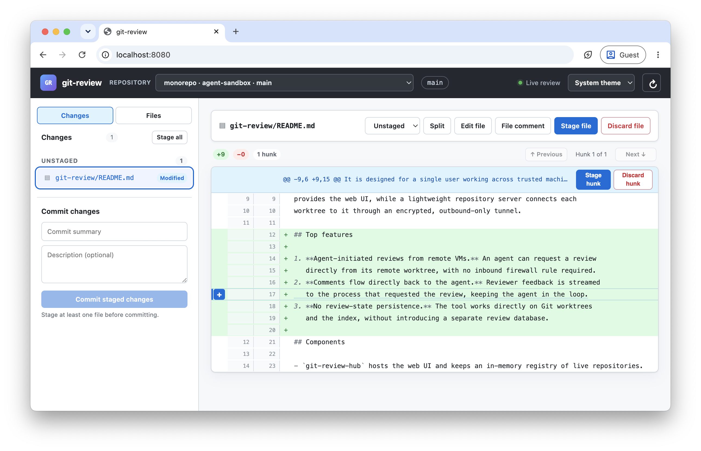

# git-review

`git-review` is a self-hosted web interface for reviewing changes in Git
worktrees on remote machines. From one browser, you can inspect diffs, edit
files, stage or discard individual changes, commit approved work, and leave
comments for the process that created the changes.

It is designed for a single user working across trusted machines. A central hub
provides the web UI, while a lightweight repository server connects each
worktree to it through an encrypted, outbound-only tunnel.



## Top features

1. **Agent-initiated reviews from remote VMs.** An agent can request a review
   directly from its remote worktree, with no inbound firewall rule required.
2. **Comments flow directly back to the agent.** Reviewer feedback is streamed
   to the process that requested the review, keeping the agent in the loop.
3. **No review-state persistence.** The tool works directly on Git worktrees
   and the index, without introducing a separate review database.

## Install

The tools are standalone Go binaries available from
[GitHub Releases](https://github.com/OrKoN/git-review/releases). On the host,
install the hub with:

```sh
curl -fsSL https://raw.githubusercontent.com/OrKoN/git-review/main/install.sh | sh -s -- hub
```

Replace `hub` with `vm` when running the command on a remote VM. The installer
places the appropriate binaries in `~/.local/bin` using platform-independent
names: `git-review-hub` on the host, and `git-review` plus `git-repo-server` on
the VM. See
[Installation and setup](docs/installation.md) for enrollment and startup
instructions.

## Getting started

Start the hub on the host:

```sh
git-review-hub --listen :8080
```

In another host terminal, generate an enrollment bundle. Replace `HOST_ADDRESS`
with an address reachable from the remote VM:

```sh
git-review-hub enroll --hub-url http://HOST_ADDRESS:8080 --name build-agent-1
```

The second command prints a one-time enrollment bundle. On the remote VM,
connect `git-review` to the hub and paste that bundle when prompted:

```sh
git-review enroll
```

Then request a review from inside any Git worktree:

```sh
git-review --message "Review these changes"
```

Open `http://HOST_ADDRESS:8080/` in a browser. Comments submitted in the web UI
flow back to the `git-review` process on the VM.

## Components

- `git-review-hub` hosts the web UI and keeps an in-memory registry of live repositories.
- `git-repo-server` owns one worktree and exposes its token-protected review API.
- `git-review` starts or reattaches to the current worktree's background server,
  opens its hub URL, and streams review comments to stdout for an agent.

Repository servers create encrypted, mutually authenticated outbound tunnels to
the hub. The browser uses only the hub origin; no agent port or repository token
is exposed to it.

See [SECURITY.md](SECURITY.md) for the trust model, deployment requirements,
credential handling, threat boundaries, and incident guidance.

For local development and release builds, see
[Building and testing](docs/development.md).

## License

`git-review` is available under the [MIT License](LICENSE).

This is a personal (no guarantees whatsoever) project, not associated with my employer.
